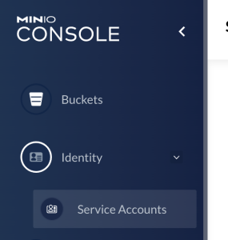

# Minio

Minio is an object store very similar to AWS S3. It allows your data to be remotely accessible via the S3 protocol.

## Python API

Steps to access data using Python Minio client API

### 1) Log into Minio. 
If you get an error "Expecting a policy to be set for user `X` or one of their groups", contact Pasha, Arfath or Kohli, Armaan with the 'X' String and the names of the buckets you need access to so we can give you access to these buckets.

### 2) Create a "Service Account" with a simple access key and the recommended secret key. 

Copy the secret key to clipboard on creation.



### 3) Store your credentials in an env file.
#### Create .env
```
# create and populate `env.txt` file
ACCESS_KEY=<ACCESS_KEY>
SECRET_KEY=<SECRET_KEY>
CA_CERTS=<PATH_TO>/certificate.crt
URL_PORT=pllimsksparky3:9000
BUCKET=cdm-data


$ ls -la
drwxr-xr-x    4 xxx  xxx   128 Jun  1 11:20 .
drwxr-xr-x  121 xxx  xxx  3872 May 26 13:50 ..
-rw-r--r--    1 xxx  xxx    42 Jun  1 11:20 env.txt
```

### 4) Change permissions to the dotenv file so only you can read and write to it.
#### Permissions
```
$ chmod 600 .env
$ ls -la-rw------- 1 xxx xxx 42 Jun 1 11:20 env.txt
```
### 5) Install the `msk_cdm` python package 
```
$ conda activate <YOUR_CONDA_ENV>
$ git clone https://github.com/clinical-data-mining/msk_cdm.git
$ cd msk_cdm
$ pip install .
```

### 6) Get the full SSL certifcate chain for the Minio instance
#### SSL Cert
```
openssl s_client -showcerts -verify 5 -connect HOST:PORT > certificate.crt

example:
openssl s_client -showcerts -verify 5 -connect tllihpcmind6:9000 > certificate.crt
```

| URL                                | HOST           | PORT |
|------------------------------------|----------------|------|
| https://pllimsksparky3:9001/       | pllimsksparky3 | 9000 |


### 7) Demo
[Try our Jupyter notebook demonstrating how download and upload data to MinIO](https://github.com/clinical-data-mining/msk_cdm/blob/main/examples/minio_demo.ipynb)


## Access via R

Data stored in minio can be accessed in R in the following fashion:
```
# sample r/minio interface via aws.s3

# load external libs
library(aws.s3)
library(httr)
library(dplyr)

# disable ssl verification (required for the time being)
httr::set_config(config( ssl_verifypeer = 0L ))

# params need to be written to environment
Sys.setenv(AWS_SECRET_ACCESS_KEY="***",
AWS_ACCESS_KEY_ID="***",
AWS_S3_ENDPOINT="tllihpcmind6:9000",  # server name
AWS_DEFAULT_REGION="") # region env variable doesn't work must be specified with each call

# list all buckets
bucketlist(region="")

# get bucket
b <- aws.s3::get_bucket(bucket='sample-bucket', region="")
print(b)

# read csv from minio bucket
obj <- aws.s3::get_object(object="test.csv",
bucket='sample-bucket', region="")
csvcharobj <- rawToChar(obj)  
con <- textConnection(csvcharobj)  
data <- read.csv(file = con)
close(con)
# head(data, n=2)


# write csv file back to minio
con <- rawConnection(raw(0), "r+")
write.csv(data, con)
aws.s3::put_object(file = rawConnectionValue(con),
bucket = "sample-bucket", object = "test_write.csv", region="")
close(con)
```


## Troubleshooting
1. If while making a minio client call (mc) you get a certificate error, use '–insecure' in your call to disable certificate verification. The connection will still be encrypted, ony that the certificate verification process with a certificate authority will be skipped in the SSL protocol. This is sometimes necessary for self-signed certificates. Our certificate is a self-signed certificate issued by MSK Open Systems .

2. **mc: <ERROR> Unable to initialize new alias from the provided credentials. Get "https://pllimsksparky3:9006": dial tcp: lookup pllimsksparky3 on 140.163.135.19:53: server misbehaving.**
   * Solution: Ping the server to get its IP address and add it to you '/etc/hosts' file as '10.254.130.16 pllimsksparky3'.

---
[Documentation adapted from MSK-MIND](https://mskconfluence.mskcc.org/display/MM/Minio)


